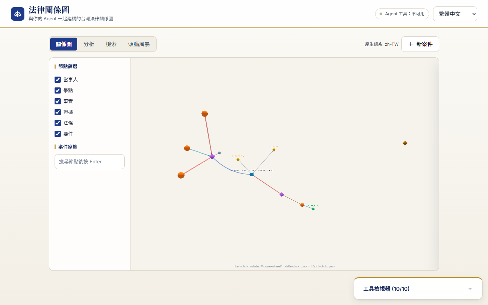
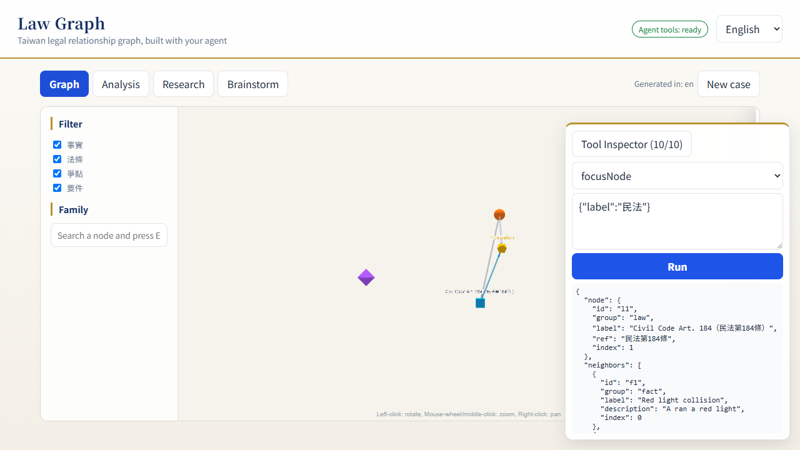

# Taiwan Legal Graph × WebMCP

**One sentence:** paste a fictional Taiwan legal dispute, answer up to three rounds of outcome-changing clarification when needed, and get a verified, interactive 3D legal-relationship graph — while the human still reviews and submits every answer round.





> 中文摘要：把 law-powers 法律技能包做成網站。貼入案情或上傳 PDF／Markdown／DOCX，並勾選要產出的項目（關聯圖，及起訴狀、理由狀、陳報狀、準備狀、答辯狀、爭點整理、上訴狀、聲請狀八種書狀）→ 整理案情與爭執點 → 補充案情（等待你的回答，最多追問三輪） → 找法條與判決 → 逐條檢查是否符合法律要件 → 對方會怎麼反駁、誰要負責證明 → 撰寫法院文件 → 畫出法律關係圖。結果頁另有「當事人準備清單」分頁（有清單資料才顯示），依分類列出待準備事項並提供 CSV 匯出與單獨列印。附件只在記憶體處理、不保存原檔；掃描型 PDF 頁面會由視覺模型忠實轉錄並標示需人工核對。頁面以 WebMCP 暴露工具供 ChatGPT／Chrome Agent 操作（`startCase` 仍為純文字契約），若產生問題，送出答案仍由人確認。

## Why WebMCP

The state that matters lives only in the browser tab: the running workflow, the questions waiting for a human, the rendered 3D graph and its camera. A REST API cannot hand an Agent the *page*. WebMCP lets the page itself publish a small, typed contract:

- **Agent:** `listSampleCases` → `startCase` → poll `getCaseStatus` → read `getAnalysis` / `getGraphSummary` → `focusNode` / `filterGraph` / `explainEdge` → `verifyCitation` on anything it wants to quote.
- **Human:** reviews the Agent's proposed answers and submits each clarification round. After every submission the service may ask a new, non-repeated set of outcome-changing questions, up to three rounds. There is deliberately **no `submitQuestions` tool** — `getQuestions` explains the visible fields, while `fillQuestions` only writes into them and never sends the case onward without human confirmation.

Tools are registered imperatively with `document.modelContext.registerTool()` and synchronised to the current page state: `INPUT` exposes 4 tools, `RUNNING` exposes status/reset (2), `QUESTIONS` exposes status/questions/fill/reset (4), `RESULT` exposes analysis and graph tools (8), and `FAILED` exposes status/reset (2). The previous state is aborted when the page changes, so an Agent cannot keep using a stale tool list to submit another sample. Every result is capped at 1,500 characters. Browsers without WebMCP get the same state-specific operations through a built-in Tool Inspector.

## What humans and agents accomplish together

```text
Human pastes facts ──► Agent: startCase ──► BRAINSTORM ──► QUESTIONS ──► Human reviews/submits
                                                   │          │                     │
                              Agent: getQuestions / fillQuestions ◄─────────────────┘
                                                   │
                        Agent: getCaseStatus ◄─────┘──► RESEARCH ──► ANALYSIS ──► ASSESSMENT ──► DOCUMENTS ──► GRAPH
                                                                          │
                        Agent: getGraphSummary / focusNode / explainEdge / verifyCitation ◄──────────┘
```

Video script skeleton: (1) open the site in ChatGPT, list samples; (2) Agent starts `car-accident`; (3) progress bar advances, page turns to *questions* — Agent calls `getQuestions`, proposes answers with `fillQuestions`, and the human reviews/submits; (4) graph appears; Agent summarises, flies to 民法第184條, explains an edge; (5) Agent verifies a citation against law.moj.gov.tw.

## Architecture

```text
Browser (HTML/JS, no framework)
  ├─ views/*.js        pure render(model, locale) → HTML string (node-tested, all model text escaped)
  ├─ graphView.js      law-powers 3D renderer (three.js + 3d-force-graph) as an ES module
   ├─ webmcp.js         thirteen tool definitions + execute, state-synchronised registration
   └─ inspector.js      read-only viewer for the same thirteen tools (state + tool list; no direct execution)
        │ 2 s polling  GET /api/cases/{id}
Spring Boot 4.1 / Embabel 1.5.1 (Java 21)
  ├─ LegalGraphAgent   seven @Action steps: planResearch → dual-track research → analyze (incl. selected pleadings) + WaitFor.awaitable
  ├─ Skills            law-powers legal-brainstorming / legal-research / legal-element-analysis / legal-graph
  ├─ GraphRules        4 hard rules after model output: every node needs a whitelisted group (inferred from
  │                    ref/jid when the model omits it), law/judgment nodes must be anchored in research,
  │                    element findings only from analysis, edge labels from a fixed whitelist
  └─ Spring AI MCP clients ──► legal-mcp sidecar (Python, mcp-taiwan-legal-db, Streamable HTTP)
             └─ optional tw-legal-rag (Streamable HTTP/OAuth, lazy runtime client)
                └─ Java orchestration: parallel retrieval → JID dedupe → citation allowlist → merged evidence
```

Only six sidecar tools are whitelisted for the Agent: `search_regulations`, `query_regulation`, `get_pcode`, `search_judgments`, `get_judgment`, `get_citations`. The LLM is selected by the `MODEL` value in `.env` (`embabel.models.default-llm`) and defaults to `gpt-5.4-nano`. The model catalogue is the project-owned `src/main/resources/models/openai-models.yml`, which shadows the copy bundled with Embabel 1.5.1 so that OpenAI-compatible providers can be used: set `OPENAI_BASE_URL` (including `/v1`, e.g. `https://api.meta.ai/v1` for Meta Muse) and pick a `MODEL` that exists in that file (`muse-spark-1.3-contributor`, `muse-spark-1.3`, `gpt-5.4-mini`, `gpt-5.4-nano`). Leave `OPENAI_BASE_URL` unset to talk to api.openai.com.

## WebMCP implementation

```js
// src/main/resources/static/js/webmcp.js (excerpt)
{ name: 'startCase', view: 'INPUT', annotations: {},
  description: 'Start analysing a Taiwan legal dispute from free text or a sample id. Returns caseId and status.',
  inputSchema: S({ caseText: { type: 'string', minLength: 20 }, sampleId: { type: 'string' }, locale: LOCALE }) }

await modelContext.registerTool({ name, description, inputSchema, annotations,
  execute: (input) => exec[name](input || {}) }, { signal: controller.signal });
```

| Tool | Available view | Read-only | Purpose |
| --- | --- | --- | --- |
| `listSampleCases` | `INPUT` | ✓ | Fictional sample disputes (en / zh-TW) |
| `setOutputSelection` | `INPUT` | | Tick the outputs-to-generate checkboxes (graph + pleadings); never starts the case |
| `startCase` | `INPUT` | | Start from `caseText` or `sampleId`; optional `documents` picks pleadings to draft; refuses if a case is in progress |
| `getCaseStatus` | `RUNNING`, `QUESTIONS`, `RESULT`, `FAILED` | ✓ | Current view/status, questions and next action (never the full result) |
| `getQuestions` | `QUESTIONS` | ✓ | List each visible question, its `questionId`, why it is asked and the `fillQuestions` JSON shape |
| `fillQuestions` | `QUESTIONS` | | Fill proposed answers into visible fields by `questionId`; rejects unapplied answers, never submits, human review required |
| `verifyCitation` | `INPUT`, `RESULT` | ✓ | Does 民法第184條 / 最高法院…字第…號 exist in the official databases? |
| `resetCase` | `RUNNING`, `QUESTIONS`, `RESULT`, `FAILED` | | Back to the input screen after the human explicitly asks |
| `getAnalysis` | `RESULT` | ✓ (untrusted content) | One section: `brainstorm`, `research`, `analysis`, `documents` |
| `getGraphSummary` | `RESULT` | ✓ | Node counts by group, edges, issues, unmet elements |
| `focusNode` | `RESULT` | | Fly the camera to a node by id or label text; returns neighbours |
| `filterGraph` | `RESULT` | | Show only some groups / one family; `reset` |
| `explainEdge` | `RESULT` | ✓ | Label, relation type and note of one edge |

Environment notes: in **Chrome 149+** enable `chrome://flags/#enable-webmcp-testing`, then `await document.modelContext.getTools()` returns the tools for the current view (6 / 2 / 4 / 9 / 2 for `INPUT` / `RUNNING` / `QUESTIONS` / `RESULT` / `FAILED`; the WebMCP layer ships as a separate `js/webmcp-bundle.js` loaded synchronously in `<head>` so tools are registered before the app bundle runs). In the **ChatGPT desktop app**, the address-bar *Site tools* list is page-scoped and should be refreshed after a state transition. The declarative (`<form>`-based) WebMCP API is not used.

## UI design system

The front end follows the **Trust & Authority** pattern from `ui-ux-pro-max` (`design-system/law-graph/MASTER.md`): ivory background, navy primary (`#1e3a8a`), gold accents, EB Garamond / Noto Serif TC headings, Inter / Noto Sans TC body. Every colour, spacing, radius and duration is a CSS token in `static/css/app.css`; components never hard-code hex values. Built-in checks: 4.5:1 contrast, 44 px touch targets, visible `:focus-visible` rings, `aria-current` stepper, `tablist` tabs with arrow-key navigation, inline validation on the case text (submit enabled at 20 chars), element findings encoded by symbol + text + colour, `prefers-reduced-motion`, and no horizontal scroll at 375/768/1440 (`npm run e2e:visual`).

## Run locally

### Entry-flow regression checks

The homepage loads independently of the 3D libraries. Those libraries are downloaded in dependency order only when a graph result is displayed, with a 15-second timeout per script and a visible failure message. Entry metadata requests (`me`, quota, usage, semantic authorization, samples) have an 8-second timeout; identity is fetched independently, and the other metadata requests run concurrently. Case submissions retain their existing timeout behavior.

For local browser verification without Google credentials or LLM calls, run `npm run bundle` and `node e2e/stub-server.mjs 8091 --entry`. This mode uses a **simulated** login redirect and a fixed fictional completed case. Add `--fail-graph` to return 503 for graph libraries, or `--slow-entry` to leave metadata requests unanswered. Verify anonymous entry, simulated login (quota 1 → 5), form POST logout (5 → 1), reload, and graph failure with readable text result tabs. The fixture binds only to loopback. It does not verify a real Google OAuth callback.

Run `npm test` for the frontend regression tests. The focused backend checks are `mvn -Dtest=DailyCaseQuotaControllerTest,AccessPolicyTest test` with Java 21. On Windows, if Java fails before test execution with `Unable to establish loopback connection` / `UnixDomainSockets ... Invalid argument: connect`, set a short existing socket directory using `-DargLine=-Djdk.net.unixdomain.tmpdir=D:/GitHub/webmcp/test` (adjust to an existing short path on your machine).

Requires Java 21, Node 20+, Docker and an OpenAI key.

```powershell
Copy-Item .env.example .env          # fill OPENAI_API_KEY, OPENAI_BASE_URL (OpenAI-compatible endpoint) and MODEL; CF_TUNNEL_TOKEN only for the tunnel
docker compose up -d --build         # app + legal-mcp (+ cloudflared if the token is set)
```

Open `http://localhost:8080`. For Java-only development run the sidecar in Docker and the app from Maven:

```powershell
docker compose up -d --build legal-mcp
# Spring Boot 會從專案根目錄的 .env 載入 MODEL、OPENAI_API_KEY 與 OPENAI_BASE_URL
$env:LEGAL_MCP_URL = 'http://localhost:8000'
mvn spring-boot:run
```

語意軌預設關閉，以避免尚未完成 OAuth 的 remote MCP 影響網站。完成 OAuth、確認 `tools/list`（預期 `search_bundle`）與服務條款後，才在受控環境設定。TLR 的 authorize 端點對已註冊 client 自動同意（302 直接回 callback），因此程式會在啟動時自行走完 start → authorize → callback，一般情況下使用者不需按任何按鈕；只有 provider 改成需人工同意時，前端才會顯示授權按鈕導向 `/api/auth/tw-legal-rag/start`。access token 只留在 runtime memory；`client_id` 與 refresh token 依 `LAWGRAPH_OAUTH_SESSION_STORE` 持久化：`db` 寫入 PostgreSQL 的 `oauth_session` 資料表（與每日用量共用 `LAWGRAPH_DB_URL`，重佈不必重新授權），`file`（本機預設）以原子替換寫入 `LAWGRAPH_OAUTH_SESSION_PATH` 並限制成檔案擁有者可存取。

```powershell
$env:SPRING_PROFILES_ACTIVE = 'semantic-mcp'
$env:LAWGRAPH_SEMANTIC_ENABLED = 'true'
$env:TW_LEGAL_RAG_URL = 'https://tlr.dr-legal.com.tw'
$env:LAWGRAPH_PUBLIC_BASE_URL = 'https://law-graph-webmcp.zeabur.app'
$env:LAWGRAPH_OAUTH_SESSION_PATH = 'D:\secure-data\tw-legal-rag-session.json'
mvn spring-boot:run
```

session 恢復會在應用啟動完成後於背景執行，不會阻塞健康檢查或 keyword 軌道。refresh token 被 token endpoint 以 4xx 明確拒絕時才清除 session 檔；timeout、5xx 或暫時性 metadata 錯誤會保留檔案供下次重試。所有錯誤仍會保留 keyword 結果，並在 `research.coverage`／`notes` 標示降級。不會關閉 TLS 驗證，也不會把 token 放入環境輸出、REST 結果或 log。

Zeabur 啟用語意軌時設定 `LAWGRAPH_OAUTH_SESSION_STORE=db`，refresh token 存同專案 PostgreSQL；即使資料庫沒有憑證，啟動時也會自動重新授權。多副本正式環境應改用共享且具加密與輪替能力的 security component。

測試時可在啟動案件的請求加上 header `X-LawGraph-Model: gpt-5.4-nano`，該案件改用便宜的測試模型跑（後端只接受 `LAWGRAPH_TEST_MODEL` 這一個值，其他值一律忽略）；`scripts/verify-semantic-live.mjs` 預設就帶這個 header，環境變數 `TEST_MODEL=` 設空字串可改用線上預設模型。

The sidecar binds `0.0.0.0:8000` explicitly (`mcp.settings.host`), because `mcp-taiwan-legal-db` 1.0.0 ignores `FASTMCP_HOST` and would otherwise listen on `127.0.0.1` inside the container.

## Tests

```powershell
mvn test                                    # Maven unit tests (domain rules, dual MCP, prompts, agent, REST)
mvn verify -Dtest=LegalMcpIT                # starts the real sidecar via Testcontainers, verifies 民法第184條
npm test                                    # 34 node --test cases: i18n, state machine, client, views, graph, WebMCP contract
npm run e2e                                 # Playwright: smoke (no LLM; fake modelContext) + journey (needs E2E_LIVE=1)
npm run stub                                # static + stubbed /api server on :8090 — no Spring Boot, no LLM
$env:BASE_URL='http://localhost:8090'; npm run e2e:visual   # UI/a11y regression: 375/768/1440 screenshots -> docs/ui-review/
$env:E2E_LIVE='1'; npm run e2e              # full human/agent journey against a live backend
npm run eval                                # 4 samples × 2 locales; counts nodes removed by the hard rules → eval/
```

`e2e/smoke.spec.mjs` injects a fake `document.modelContext` and asserts, for every page state, that the native tool list and the Inspector list contain exactly the same available tools; in `QUESTIONS` it also verifies `getQuestions` returns the question map, the Inspector displays the matching JSON template, and `fillQuestions` updates the visible field without submitting.

### Tutorial screenshots

```powershell
$env:E2E_LIVE='1'; npx playwright test -c e2e/playwright.config.mjs e2e/tutorial.spec.mjs
```

`e2e/tutorial.spec.mjs` walks the whole human/agent journey in **English and 繁體中文** and saves one screenshot per action to `docs/tutorial/<locale>/NN-*.png` (21 frames each: input → progress with partial results → questions → answers → graph → four tabs → every Inspector tool → focus/detail panel → filter → verify citation → new case). These frames are the storyboard for the demo video. While a case runs, the page already lists the results of finished steps under *Results so far*, and every progress screen has a *Cancel and start over* button.

## Limitations

- The configured `MODEL` output quality varies; the hard rules remove unverifiable nodes rather than "fix" them, so graphs can be small. Choose a stronger model in `.env` when quality matters more than cost.
- The judicial.gov.tw WAF can block judgment lookups; the sidecar falls back to Playwright but may still fail.
- Case state is in memory only; a restart loses running cases. Rate limit is 10 cases / hour / IP.
- **Daily AI budget**: the hosted site shares one LLM budget of `LAWGRAPH_DAILY_TOKEN_LIMIT` tokens per Asia/Taipei day (input + output, default 2,000,000). Once spent, or when `LAWGRAPH_LLM_PAUSED=true`, the case APIs answer `503 DAILY_TOKEN_LIMIT` and the UI shows a notice; `GET /api/usage` exposes the running total. The counter is persisted through `LAWGRAPH_USAGE_STORE`: `db` writes one row per day to the `usage_daily` table in PostgreSQL (`LAWGRAPH_DB_URL` / `LAWGRAPH_DB_USER` / `LAWGRAPH_DB_PASSWORD`; production uses the `postgresql` service in the same Zeabur project), so restarts and redeploys never reset it; `file` (default for local dev) writes `LAWGRAPH_USAGE_PATH` and only survives a same-container restart.
- **No limit with your own agent**: the analysis logic lives in the open-source [Law Powers](https://kevintsai1202.github.io/law-powers/) skill pack. Install it into your own AI agent (Claude Code, Codex, Cursor, etc.) to run the same brainstorming, research, analysis and graph workflow without the shared budget.
- Uploads accept at most 5 PDF, UTF-8 Markdown, or DOCX files, 10 MB each and 60,000 extracted characters in total. Files are processed in memory and not persisted. PDF pages without a text layer are sent to the configured vision-capable model (up to 20 pages), labeled with their page number and review requirement; encrypted PDFs are rejected.
- Semantic `tw-legal-rag` uses a lazy runtime OAuth client and feature flag; production enablement remains gated on authenticated `tools/list` schema and service-term confirmation.
- Google sign-in (optional): set `GOOGLE_CLIENT_ID` / `GOOGLE_CLIENT_SECRET` (the local `.env` may use `CLIENT_ID` / `SECRET`) and register the callback `https://<host>/login/oauth2/code/google` in Google Cloud Console. Signed-in users are counted per Google account with `LAWGRAPH_DAILY_CASES_PER_MEMBER` (default 5); anonymous users keep `LAWGRAPH_DAILY_CASES_PER_USER` (default 1). Without the client id the sign-in button is hidden and everything stays anonymous.
- Per-person daily quota: `LAWGRAPH_DAILY_CASES_PER_USER` (default 3, `0` = unlimited) caps how many cases one client IP may start per Taipei calendar day. The 4th request returns `429 DAILY_CASE_LIMIT` with an explanation (the site is free; the cap keeps it available for more people). `GET /api/quota` reports `used / limit / remaining` for the caller and the input page shows the counter. `server.forward-headers-strategy=framework` restores the real client IP behind Zeabur.
- Step watchdog: `LAWGRAPH_STEP_TIMEOUT` (default 300s) aborts a case whose current step outlives the limit; the API then returns `FAILED` with error code `STEP_TIMEOUT` and a localized message instead of retrying the LLM call indefinitely. `LAWGRAPH_LLM_TIMEOUT` (default 240s) is the per-call Embabel timeout and `LAWGRAPH_LLM_MAX_ATTEMPTS` (default 2) bounds structured-output retries.
- Live E2E / eval / tunnel steps require a real `OPENAI_API_KEY` and `CF_TUNNEL_TOKEN`; they are not run in CI.

## Legal notice

This is an analysis aid, **not legal advice**. All sample cases are fictional; do not paste real personal data. This repository is MIT licensed. `law-powers` is included as a Git submodule and keeps its own licence, including its stated restriction (free for everyone except 經兆國際法律事務所).

## Credits

[law-powers](https://github.com/kevintsai1202/law-powers) · [Embabel](https://github.com/embabel/embabel-agent) · [mcp-taiwan-legal-db](https://pypi.org/project/mcp-taiwan-legal-db/) · [3d-force-graph](https://github.com/vasturiano/3d-force-graph) · Spring AI · the WebMCP community specification.
